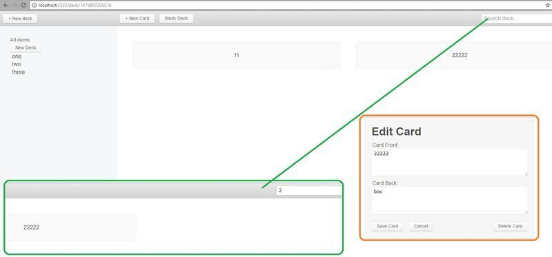

### Карточки для запоминания

 - **** Тренировка памяти, запоминание карточек.

#### Технологии
* express
* fuzzysearch
* live-server
* react
* redux-thunk

#### Эмуляция работы с API (сохраняет данные в памяти, вместо localStorage)
1. запуск сервера `node server.js`
2. http://localhost:3333

#### Развёртывание проекта
* запуск сервера `node server.js`
* http://localhost:3333

#### Получить помощь
https://bitbucket.org/stasok/flashcard-app/pull-requests/ - Ваши пожелания и замечания к проекту.

